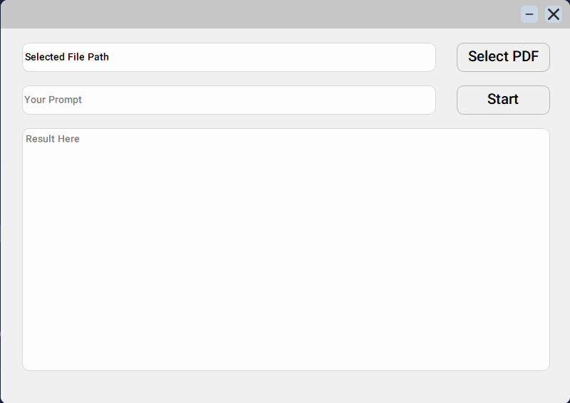
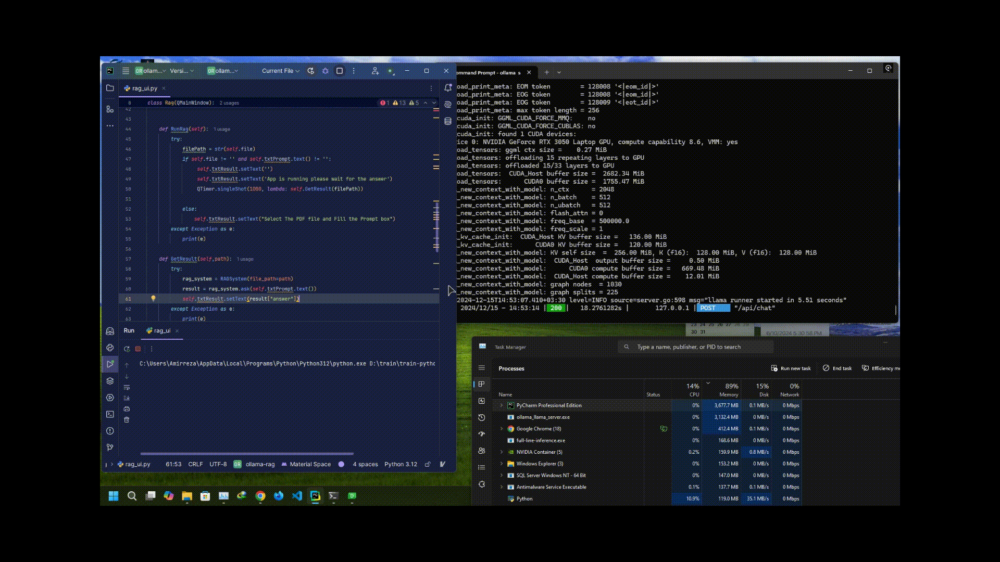

# Rag-System-with-Ollama

This repository contains a **PyQt5**-based application for mini QA Bot With **Rag**  System using the **Ollama** models.This app uses **Ollama** for Embedded and LLM Models and **langchain** to get **PDF** documents and answer questions based on your documents.

---

## Features

- **Multiple Docs**: You can upload multiple PDF file for your Context.
- **User-Friendly Interface**: Minimal and modern UI created using PyQt5.
- **Ollama**: Ollama provides both Embedded and LLM Models.
- **Local**: With Ollama we can use the models locally on our system.

## Prerequisites

### 1. Install Dependencies
The following Python packages are required:

- `PyQt5`
- `Ollama`
- `langchain`
- - `langchain_ollama`
- - `langchain_community`
- `chromadb`

Install all dependencies using pip:
```bash
   pip install -r requirements.txt
```

### 2. Install Ollama
1. Download Ollama form [Ollama](https://ollama.com/) and install it on your system.
2. Download and [Embedded](https://ollama.com/search?c=embedding) and [LLM](https://ollama.com/search?c=tools) model for your App (I used LLama 3.1 8b for llm and nomic-embed-text for Embedded model).
---

## Getting Started

### Clone the Repository
```bash
git clone https://github.com/AmirRghp/Rag-System-with-Ollama.git
cd Rag-System-with-Ollama
```

### Run Ollama

#### After Install Ollama on your system open CMD or Terminal and run these prompts
1. First download and run your LLM model (For example Llama 3.2)
```bash
ollama pull llama3.2
```
2. download and run your LLM Embedded (For example nomic-embed-text)
```bash
ollama pull nomic-embed-text
```
3. start the server , it will run the ollama on 127.0.0.1:11434
```bash
ollama serve
```
If you like use Ollama on cmd you can use this prompt :
```bash
ollama run llama3.2
```
### Customize the code for your models 
1. For LLM model put your model name in RetrievalChainBuilder init function in rag_sys.py
```python
def __init__(self, vector_store, model="your-model")
```
2. For your Embedded model put it in VectorStoreHandler init function in get_doc.py , line 48
```python
def __init__(self, chunks, embedding_model="your-model", base_url="127.0.0.1:11434", persist_dir="./sql_chroma_db")
```
---

### Run the Application
1. Make sure your Ollama is on serve.
2. Make sure you put the models names that you downloaded
3. Start the app by running:
   ```bash
   python main.py
   ```
---

## Application Usage

### Buttons:
- **Start**: Answer your Question.
- **Select PDF**: You can select your pdf files on same directory.
- **Minimize**: Minimizes the application window.
- **Close**: Closes the application.

### Dragging the Window:
- Click and hold the left mouse button anywhere on the window to drag it.

---

## Screenshot

## Video



## Common Errors
**Context not found**:
   - it's depends on your GPU , CPU and your Ram if you have high-end PC you don't have problem.

## License

This project is licensed under the MIT License. See the `LICENSE` file for details.

---
## Contributing

Feel free to submit issues or pull requests to improve this project. Contributions are always welcome!
